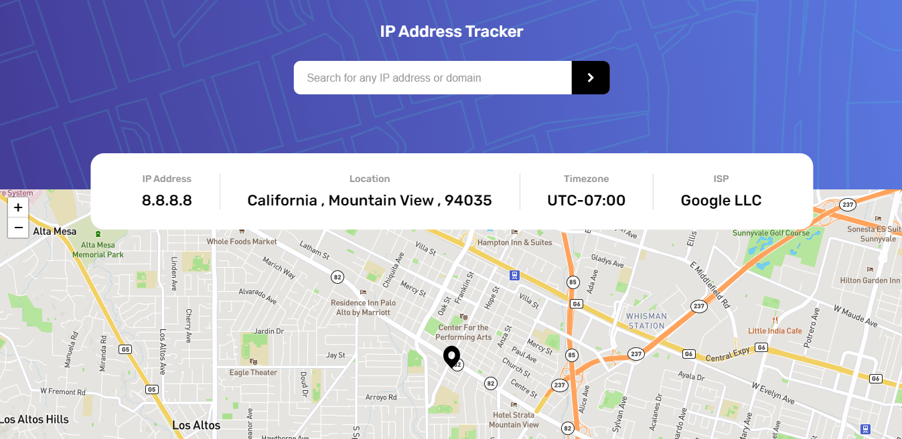

# IMPORT NOTE : ALWAYS OPEN WITH ANY LIVE SERVER 

# Frontend Mentor - IP address tracker solution

This is a solution to the [IP address tracker challenge on Frontend Mentor](https://www.frontendmentor.io/challenges/ip-address-tracker-I8-0yYAH0). Frontend Mentor challenges help you improve your coding skills by building realistic projects. 

# Overview

This is a IP Address Tracker. 
It will Search location using [IP Geolocation API by IPify](https://geo.ipify.org/) and
For Map Visualization in usess [LeafletJS](https://leafletjs.com/) [Mapbox](https://www.mapbox.com/) Map. 
For Mapbox map you must required Token (https://account.mapbox.com/access-tokens/).

# ScreenShot

# Built with

- Semantic HTML5 markup
- Sass(scss)
- Tired using NPM(node package manager)
